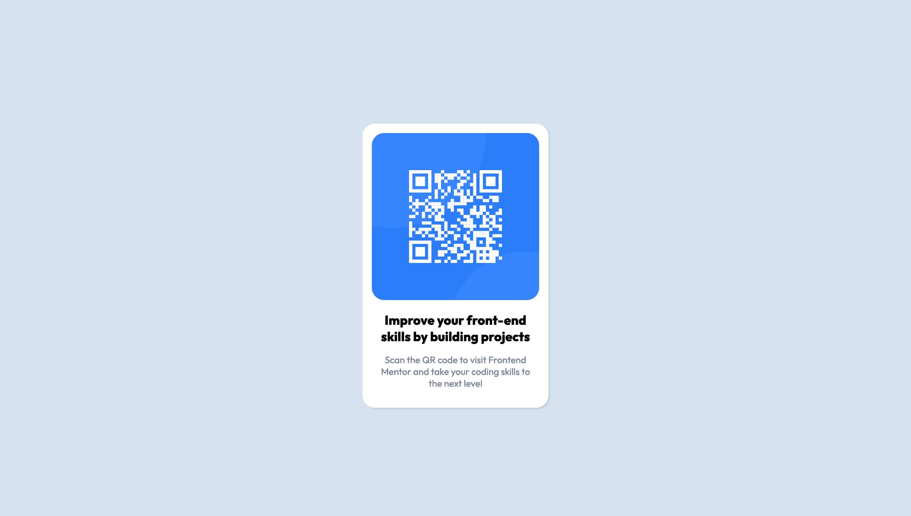

# Frontend Mentor - QR code component solution

This is a solution to the [QR code component challenge on Frontend Mentor](https://www.frontendmentor.io/challenges/qr-code-component-iux_sIO_H). Frontend Mentor challenges help you improve your coding skills by building realistic projects. 

## Table of contents

- [Overview](#overview)
  - [Screenshot](#screenshot)
  - [Links](#links)
- [My process](#my-process)
  - [Built with](#built-with)
- [Author](#author)

## Overview

I completed this as a quick project when signing up for Frontend Mntor. I was following a tutorial from Kevin Powell titled "Build a responsive website with HTML & CSS" (https://www.youtube.com/watch?v=h3bTwCqX4ns) and he was using starter filed from Frontend Mentor. This was great for reinforcing skills I had learned by completing the "Responsive Web Design Certification" curriculum via freeCodeCamp (https://www.freecodecamp.org/learn). 

I also wanted to practice the github workflow and using CSS Custom Properties. 

### Screenshot

### Links

- Solution URL: (https://github.com/ryanthayes/qr-code-component-main)
- Live Site URL:(https://ryanthayes.github.io/qr-code-component-main/)

## My process

I began by creating a repo on github and creating the necessary files from the command line to practice industry workflow. I then created the index.html document using Semantic HTML5 markup before beginning to style the content. For my stylesheet I wanted to practice with CSS Custom Properties so I began be defining the colors used in the style guide. I also wanted to practice with flexbox to position elements on the page. I am still not sure how to center a DIV element vertically on the page. "align-items: center;" did not work so I had to use margin-top to make the main content appear to be visually centered.

### Built with

- Semantic HTML5 markup
- CSS custom properties
- Flexbox

## Author

- Github - (https://github.com/ryanthayes)
- Frontend Mentor - (https://www.frontendmentor.io/profile/ryanthayes)
